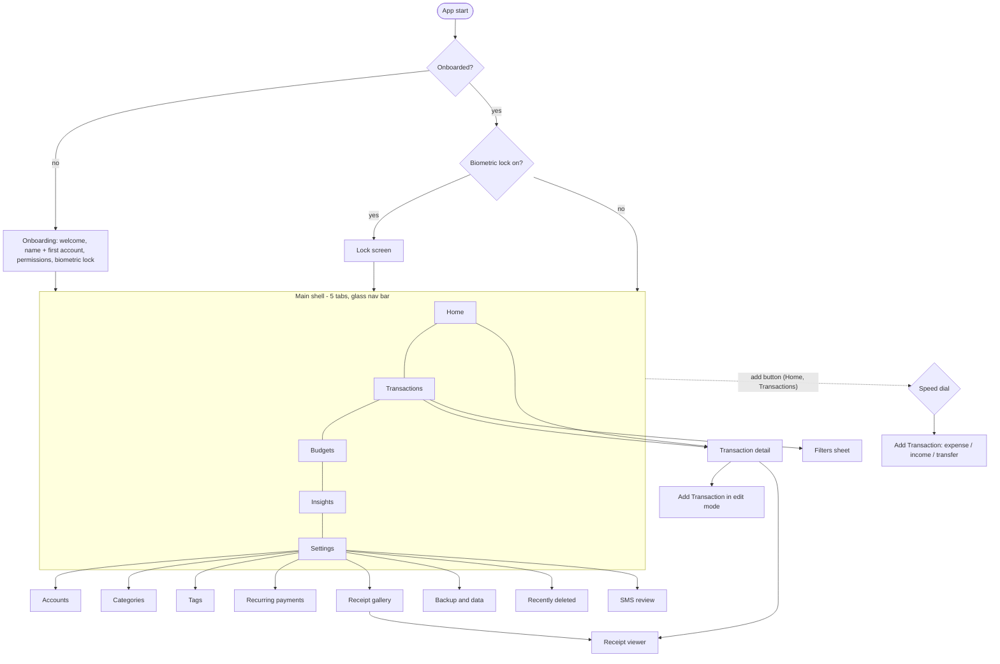

# MyKhata — UI/UX Blueprint (Design System v2)

Personal, offline-first expense tracker (Android, INR). This document is the
single reference for how the app looks, moves and is structured. It describes
what is **in the code on branch `ui-overhaul`**; anything not yet verified on a
device is called out in [§10](#10-status-gaps-and-decisions).

---

## 1. Design principles

1. **Depth carries hierarchy.** Importance is shown by how far a surface sits
   above the page (flat → low → medium → high → glass), not by more borders.
2. **One accent, used on purpose.** Deep teal means *interactive / brand*. Warm
   gold is reserved for the single most important action (the add button).
   Green and red mean *money in / money out* only — never decoration.
3. **Feedback on every touch.** Press scale, a light haptic tick, and a visible
   state change. Nothing is silent.
4. **Never a blank or a jump.** Loading shows a shimmer skeleton shaped like the
   content, empty states explain what to do, errors offer a retry in place.
5. **Fewer steps.** Sensible defaults (primary account, the saved category on
   edit), one-tap undo instead of "are you sure" where an undo exists.
6. **Numbers stay still.** Money uses tabular (equal-width) digits so amounts
   align and don't jitter while counting up.

---

## 2. Design tokens

All tokens live in `lib/core/` and are read through `context.palette`,
`AppText`, `AppMotion`, `AppHaptics`. Screens never hard-code colours.

### 2.1 Colour

| Token | Light | Dark | Role |
|---|---|---|---|
| `background` | `#F2F6F6` | `#071214` | Page |
| `surface` | `#FFFFFF` | `#0E1D20` | Cards, fields |
| `surfaceRaised` | `#FFFFFF` | `#132428` | One step above surface |
| `surface2` | `#E6EEEE` | `#16292D` | Recessed: tracks, skeletons |
| `border` | `#D9E4E4` | `#21383C` | Hairlines |
| `ink` | `#0B1F24` | `#E8F3F2` | Primary text |
| `muted` | `#52696E` | `#8FA9AC` | Secondary text |
| `primary` | `#0F766E` | `#2DD4BF` | Brand / interactive (deep teal) |
| `onPrimary` | `#FFFFFF` | `#032321` | Text on primary |
| `secondary` | `#FFB627` | `#FFC247` | Gold — the add button only |
| `income` | `#15803D` | `#5BE29A` | Money in |
| `expense` | `#D92D3A` | `#FF7A82` | Money out, destructive |
| `primarySoft` | primary @ 10% | primary @ 18% | Selected backgrounds |
| `glass` | white @ 78% | `#0E1D20` @ 72% | Floating chrome |
| `glassBorder` | white @ 90% | white @ 8% | Glass edge highlight |

Hero gradient — light `#0D756B → #0A4A52`, dark `#0D6B65 → #082F36`.
Chart palette: coral `#FF8A5B`, blue `#4F9DFF`, mint `#46D6A4`, gold `#FFB627`,
purple `#C77DFF`, sky `#38BDF8`, pink `#F472B6`.

**Measured contrast (WCAG, computed from the hex values above):**

| Pair | Ratio | AA text (4.5) |
|---|---|---|
| Light: ink on page / on card | 15.6 / 17.0 | pass |
| Light: muted on page / card / recessed | 5.4 / 5.8 / 5.0 | pass |
| Light: primary on card · white on primary | 5.5 · 5.5 | pass |
| Light: expense · income on card | 4.8 · 5.0 | pass |
| Dark: ink on page / card | 16.8 / 15.3 | pass |
| Dark: muted on card / recessed | 6.9 / 6.1 | pass |
| Dark: primary · expense · income on card | 9.3 · 6.9 · 10.5 | pass |
| Primary button text (light · dark) | 5.5 · 8.9 | pass |
| Hero: white / 90% caption / chip label (light start) | 5.6 / 4.8 / 6.5 | pass |
| Nav: selected label on glass (light · dark) | 5.4 · 9.6 | pass |
| Text on gold add button | 9.4 | pass |

### 2.2 Typography (Sora)

| Style | Size / weight | Use |
|---|---|---|
| `display` | 26 / 800, tracking −0.5, tabular digits | Screen titles, big totals |
| `title` | 18 / 800 | Sheet and card titles |
| `bodyStrong` | 14 / 700 | Row titles, emphasised values |
| `body` | 14 / 600 | Default text |
| `caption` | 12 / 500 | Secondary info |
| `section` | 12 / 700, tracking 0.4 | Field and group labels |
| `overline` | 11 / 700, tracking 1.0 | Small caps labels |
| `button` | 15 / 800 | Buttons |
| `amount(size)` | 800, tabular digits | Every money figure |

All text uses Flutter's text scaler, so system font-size settings apply.

### 2.3 Spacing, shape, elevation

* **Grid:** 4 pt base; page gutter 18; section gap 22; card padding 14–22.
* **Radii:** fields 16 · cards 20 · buttons 20 · nav 26 · hero 28 · sheets 28
  (top) · pills 20 · dialogs 24.
* **Touch targets:** ≥ 44 px (nav 66, segmented control 44, pills 44, buttons 54).
* **Elevation** — each level is a soft ambient layer plus a tight key layer:

| Level | Token | Use |
|---|---|---|
| flat | none | Inside an already-raised card |
| low | `shadowSm` | List rows |
| medium | `shadowMd` | Default card |
| high | `shadowLg` (+ `surfaceRaised`) | Hero, one focal panel per screen |
| glow | `primaryGlow` | Primary button |
| glass | blur σ18 + `glass` | Bottom navigation |

### 2.4 Motion

| Token | Value | Use |
|---|---|---|
| `instant` | 90 ms | Press scale / dim |
| `fast` | 180 ms | Colour and state changes |
| `medium` | 280 ms | Segmented thumb, FAB scale |
| `slow` | 420 ms | Nav indicator glide |
| `emphasized` | cubic(0.2, 0, 0, 1) | Things sliding into place |
| `bounce` | easeOutBack | FAB, selected nav icon |
| `stagger(i)` | 45 ms × i (cap 8) | List entrance |

Skeleton shimmer holds still when the system "remove animations" setting is on.

### 2.5 Haptics (`AppHaptics`, switch in Settings → App)

| Kind | Fires on |
|---|---|
| `tap` (light) | Buttons, rows, add button, nav tap |
| `select` (tick) | Tabs, chips, dropdown choice, checkboxes, nav tab change |
| `success` (medium) | Transaction saved |
| `warning` (heavy) | Destructive action confirmed |

---

## 3. Component library

| Component | Purpose | States covered |
|---|---|---|
| `PrimaryButton` | Main call to action; teal gradient + glow | default · pressed (scale + dim + haptic) · loading (spinner) · disabled (flat, muted) |
| `Pressable` | Tactile wrapper for any tappable | idle · pressed · disabled (no feedback) |
| `AppCard` | The one card surface; `CardElevation` flat/low/medium/high | static · tappable (ink ripple) |
| `SegmentedTabs` | 2–4 way switch, gliding thumb | selected · unselected · pressed |
| `PillChips` / `PillChip` | Single / multi choice chips | selected (filled + glow) · unselected |
| `AppDropdown<T>` | Single-choice list picker (category, account, filters) | value · placeholder · empty list (disabled) · search (> 7 items) · selected tick |
| `MultiSelectField` | Multi-choice picker (tags) with removable chips | empty · chips · no-options message |
| `AppBottomSheet` | Modal sheet for forms and pickers | scrolls with keyboard |
| `confirmDestructive` | Delete confirmation, red action | cancel · confirm (+ warning haptic) |
| `UndoSnackbar` | Reversible action feedback | visible above the nav bar |
| `Skeleton` / `SkeletonCard` | Loading placeholders (shimmer) | animating · reduced-motion still |
| `EmptyState` | Haloed illustration, message, action | full-screen · compact (in card) |
| `AsyncSection` | Wraps any async block | loading skeleton · data · **inline error + Retry** |
| `FadeSlideIn` | Entrance animation | staggered by index |
| `TransactionRow` | One transaction (swipe-to-delete) | normal · dismissing |
| `BudgetRow` | Budget progress bar + status | under · near limit · over |
| `ReceiptViewer` | Full-screen pinch-to-zoom receipt | image · broken-image fallback |
| Floating nav bar | 5 tabs, glass, gliding indicator | selected · unselected |
| Add button + speed dial | Expense / Income / Transfer | closed · open (frosted scrim) · hidden on tabs without it |

Field style (`appFieldDecoration`): filled surface, 16 radius, hairline border,
2 px teal focus ring. Used by every text field and dropdown.

---

## 4. Navigation architecture

**Rules**

* Five permanent destinations (Home, Transactions, Budgets, Insights,
  Settings) — the maximum a thumb-reachable bottom bar should hold.
* Everything else is a pushed screen with a standard back arrow; forms and
  pickers are bottom sheets.
* **Back button:** closes the add menu first → returns to Home → leaves the app.
  The app lock is a gate over the whole app, not a route, so back can never
  skip it and in-progress work is preserved.
* **Edit** opens on top of Detail, so saving returns to Detail, which reloads.
* Snackbars on the shell sit **above** the nav bar (and the add button when
  visible); on pushed screens they use the default position.
* Page transitions come from one shared builder, so every push/pop feels alike.

---

## 5. Screen blueprint

Each screen follows: **Purpose → Layout → Data → States → Interactions.**
"Skeleton / empty / error" are the loading, no-data and failure states.

### Shell and entry
| Screen | Layout and behaviour |
|---|---|
| **Onboarding** (4 steps) | Welcome (value pillars: bank messages sorted for you, receipts, early budget warnings) → name + first bank account (more can be added; at least one required, with inline errors) → permissions (notifications, location, camera, SMS — each optional, "Allow selected") → biometric lock ("Maybe later" allowed). Ends with "Open MyKhata". |
| **Lock** | Hero gradient mark and "Touch the sensor to unlock"; the pulsing unlock button can be tapped to retry if the prompt was dismissed. |
| **Main shell** | Tabs stay alive (scroll position, filters, form state kept) and cross-fade; glass nav bar with gliding teal indicator; gold add button with frosted-scrim speed dial. |

### Tabs
| Screen | Layout, data and states |
|---|---|
| **Home** | Greeting by time of day + name → **hero balance card** (total counts up; one chip per account, ★ marks the primary one, tap a chip to edit its balance) → Budgets (with See all) → Recent transactions (See all) → Upcoming recurring (mark paid / remind later / delete rule) → Insights ("smart observation"). Every block has skeleton, compact empty state with an action, and inline retry. |
| **Transactions** | Header with search; date chips (All / Today / This Week / This Month / Last Month); **Filters sheet**: type, payment method, date, **category and account dropdowns**; badge shows active filters. Grouped by day, infinite scroll, swipe-to-delete with Undo. Skeleton, empty, error + retry. |
| **Budgets** | Period switch (Weekly / Monthly / Yearly), overall ring, per-category rows. Tap → detail sheet: **Edit limit**, **Delete budget** (Undo), honest alert state. Create-budget sheet: period, category dropdown (flags categories that already have one), limit. |
| **Insights** | Range (Today / This Week / This Month / Last Month) → budget progress → income vs expense (saved / overspent) → spending trend → spending by category (pie + legend, extras folded into "Other") → by payment method → by account. Each chart has its own empty/error copy. |
| **Settings** | Profile card (name). **Manage:** Accounts, Categories, Tags, Recurring payments, Receipts. **Automation:** Detect bank SMS, Review detected messages, Save location with expenses. **Data:** Backup & data, Recently deleted. **App:** Biometric lock, Haptic feedback, Appearance (light/dark), About. **Danger zone:** Delete all data. |

### Transaction flow
| Screen | Layout, data and states |
|---|---|
| **Add / Edit transaction** | Type switch → large amount → description (suggests a category) → category dropdown → account dropdown (new expense defaults to the **primary account**) → payment method switch → date → note → tags (multi-select dropdown) → location (if enabled) → receipts → **Save**. Transfers show From / To and refuse identical accounts. Editing keeps the transaction's own account, category and destination. Success haptic + confirmation. |
| **Transaction detail** | Hero (category glyph, signed amount, description, type pill) → details card (category, payment method, account(s), date, source, note, created) → Tags → Location (only if saved) → Receipts (tap to zoom) → **Edit** / **Delete** (confirm, then Undo). Reloads itself after edits. |

### Management screens (all share one scaffold)
| Screen | What it does |
|---|---|
| **Accounts** | List with balance; **★ set / unset primary** (one at a time); add with a "Use as primary" switch; remove (warns if primary; transactions kept). |
| **Categories** | Add (name and type: expense / income) and delete. The colour is assigned automatically from the chart palette and the emoji is derived from the name. New categories appear in Add Transaction immediately. |
| **Tags** | Add / delete; deleting removes the tag from every transaction. |
| **Recurring payments** | Name, amount, frequency, pay-from dropdown, category dropdown, first-due date. |
| **Receipt gallery** | Grid of all receipts → zoom viewer. |
| **Backup & data** | Backup (system save dialog), Restore (confirmed, refreshes the app), Export CSV / PDF (save dialog), Import CSV with preview. Saved-location message stays on screen. |
| **Recently deleted** | Restore or delete forever (confirm). |
| **SMS review** | Detected bank messages awaiting confirmation (functionality owned and fixed by the project owner; unchanged in this overhaul). |

---

## 6. Interaction and edge-state matrix

| Situation | Behaviour |
|---|---|
| Data loading | Shimmer skeleton shaped like the content; layout never jumps |
| Reloading existing data | Where supported (lists, budgets, transaction detail) the previous data stays visible instead of flashing a spinner |
| No data | Haloed illustration, one-line explanation, a direct action |
| Load failure | Inline message + **Retry** in the same place |
| Save in progress | Button shows spinner and is disabled |
| Save success | Success haptic + snackbar above the nav bar |
| Destructive action | Confirm dialog (red action, heavy haptic); reversible ones use Undo instead |
| Invalid input | Inline error text under the form, in the error colour |
| SMS permission denied | Help sheet explaining how to enable it in Android settings |
| Backup/export finished | Persistent dialog with the location and how to find the file |
| Keyboard open | Sheets scroll; fields stay visible |

---

## 7. Accessibility checklist

* Text contrast ≥ 4.5:1 in both themes (table in §2.1). Large text ≥ 3:1.
* Touch targets ≥ 44 px on all primary controls.
* Semantic labels on nav items, buttons, segmented options, the add button.
* Haptics can be switched off; shimmer respects "remove animations".
* Colour is never the only signal: amounts carry a +/− sign, budget states
  carry text ("Over by ₹…", "… left").
* Dark theme uses lighter surfaces for raised layers (the standard dark-mode
  elevation model) rather than only heavier shadows.

---

## 8. Feature parity map

| Feature | Where it lives | Notes |
|---|---|---|
| Add / edit / delete / undo transactions | Add, Detail, Transactions | Edit preserves account, category, destination |
| Transfers between accounts | Add (type = Transfer) | Same-account blocked |
| Categories, tags | Settings → Manage; pickers in Add | Tags multi-select; categories searchable |
| Accounts + balances | Home hero, Settings → Accounts | Primary account (schema v2 `is_primary`) |
| Budgets (weekly/monthly/yearly) + alerts | Budgets, Home, Insights | Calendar-aligned windows |
| Recurring payments | Settings, Home | Mark paid / snooze / delete |
| Receipts | Add, Detail, Gallery | Camera or gallery; zoom viewer |
| Location capture | Add, Settings toggle | Only at save time |
| SMS detection + review | Settings → Automation, SMS review | Owner-maintained |
| Insights and charts | Insights, Home | Ranges: today / week / month / last month |
| Search + filters | Transactions | Type, payment, date, category, account |
| Backup / restore | Backup & data | Verified safety backup before destructive restore |
| Export CSV / PDF, import CSV | Backup & data | System save dialog |
| Recently deleted | Settings | Restore / delete forever |
| Delete all data | Settings → Danger zone | Silent verified backup first; atomic |
| Biometric lock | Onboarding, Settings | Global gate |
| Light / dark theme | Settings → Appearance | |
| Haptic feedback switch | Settings → App | New |

---

## 9. Implementation map

| Area | Files |
|---|---|
| Tokens | `core/constants/app_colors.dart`, `core/theme/app_palette.dart`, `app_text.dart`, `app_motion.dart`, `app_haptics.dart`, `app_theme.dart` |
| Components | `presentation/widgets/*` (see §3) |
| Shell | `presentation/screens/main/main_navigation_screen.dart` |
| Screens | `presentation/screens/**` |

---

## 10. Status, gaps and decisions

**Verified:** colour contrast ratios (computed); bracket balance of every edited
Dart file; that the data layer is untouched by the visual work.

**Not verified (no Flutter SDK in the build sandbox):** `flutter analyze`,
`flutter test`, and the running app. Visual details that need an on-device look:
glass blur intensity on low-end GPUs, the nav indicator glide, hero card
legibility in sunlight, and behaviour at the largest system font size.

**Known gaps**

1. **Large-text layout** is not tested; some fixed-height rows may clip.
2. **Reduce motion** is honoured by the skeleton only; entrance animations and
   the nav glide still play.
3. **Backdrop blur** costs GPU time; if it janks on older phones, drop the
   blur and keep the translucent fill.
4. The SMS review screen keeps its previous styling by request.

**Decisions for the owner**

* The brand colour changed from violet to deep teal. Gold stays as the
  add-button accent. Say so if you prefer a different accent.
* Brand change aside, the database is now schema v2 (Primary Account) and some
  earlier bug-fix work touched non-UI logic (budgets, filters, backup). If a
  strictly UI-only branch is needed, those commits can be split out.
